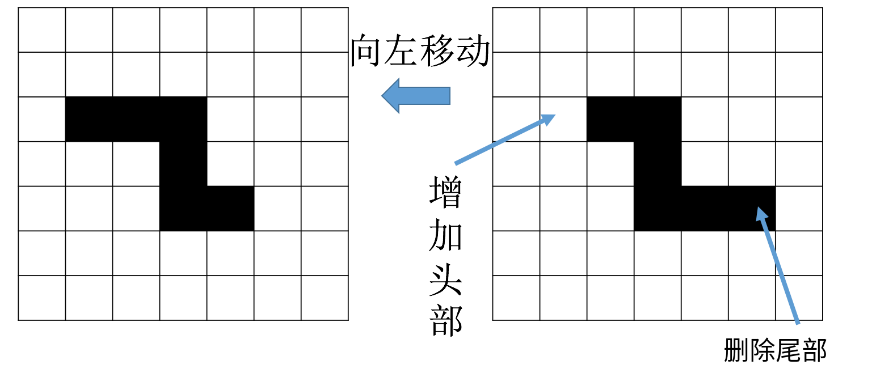
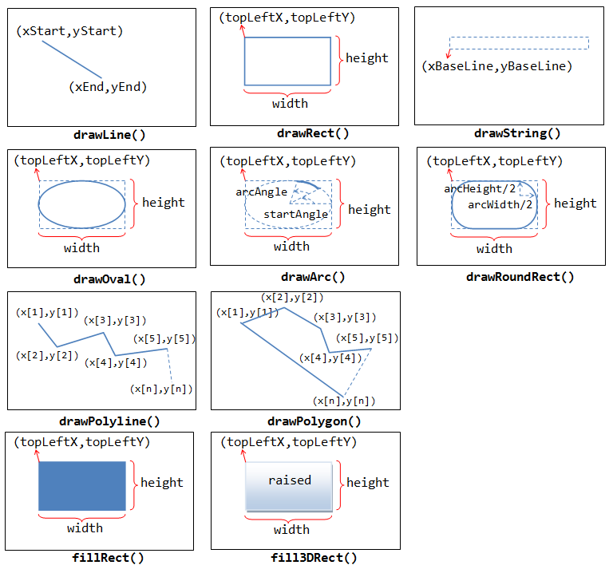
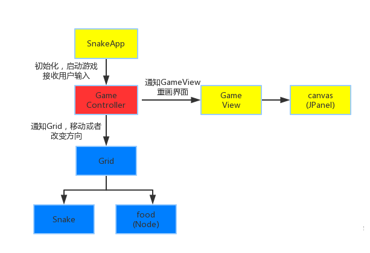

# Table of Contents

1.  [总体设计](#org69a8213)
    1.  [练习之前](#org8bce971)
    2.  [开始设计](#orgec5b829)
    3.  [表达虚拟概念的类](#orgb695b16)
    4.  [总结](#orgdbac916)
    5.  [练习](#orgf48208f)
2.  [贪吃蛇的方向](#orgba1aed6)
    1.  [使用枚举定义Direction](#orgee0069b)
    2.  [枚举的使用](#org6345b93)
    3.  [给枚举添加成员变量、方法和构造函数](#org1a8f3a6)
    4.  [枚举的其它特性](#org685fc16)
    5.  [练习](#orgbd48093)
3.  [如何定义一只贪吃蛇？集合类的使用](#org1b2ac7c)
    1.  [如何设计一个类](#orgfb8a767)
    2.  [设计成员变量](#orge6e343f)
    3.  [选择数据结构](#org59500ad)
    4.  [设计方法](#org87c4f25)
    5.  [定义意义明确的私有方法](#orgc4c2a94)
    6.  [练习](#org6980aaf)
4.  [贪吃蛇的地盘：用Grid类定义关键算法](#orge53b4b5)
    1.  [Grid的数据成员](#orga9e1539)
    2.  [Grid的构造函数](#orgfdfe431)
    3.  [关键方法：初始化贪吃蛇](#orgcb95e09)
    4.  [关键方法：随机创建食物](#orgde93faf)
    5.  [关键方法：一次移动](#org53841f6)
    6.  [练习](#org06c6c3b)
5.  [编写界面：Swing和Graphics](#org868ac73)
    1.  [应用界面](#orgb62752d)
    2.  [一个简单的Swing程序](#org9468b78)
    3.  [SnakeApp的实现](#org61e5d86)
    4.  [Graphics API](#org7249af7)
    5.  [在窗口中显示界面](#orgdfb0594)
    6.  [练习](#org3a00cbb)
6.  [交互的处理：用GameController协调界面与模型](#orgbf4953a)
    1.  [GameController的作用](#org34a1687)
    2.  [接收键盘事件](#org0bf7632)
    3.  [处理键盘事件](#org7544502)
    4.  [练习](#org049bec2)
7.  [让贪吃蛇自己动起来：Thread的使用](#orgb03bdc2)
    1.  [如何让贪吃蛇移动起来](#orgc129faa)
    2.  [多线程的基础知识](#orgf863396)
    3.  [实现游戏线程](#orgf1f4fcd)
    4.  [启动线程](#orga134241)
    5.  [在EDT中启动应用](#org2877e51)
    6.  [更进一步](#org43ebbf5)
    7.  [练习](#orge56af9a)

# 总体设计

## 练习之前

在网上能找到不少贪吃蛇的代码，但是往往写得比较乱，甚至有所有代码都包含在一个类中的情况，对于初学者而言即使能Copy后跑起来，也不一定能够真正理解代码的逻辑。

实际上实现贪吃蛇的代码并不复杂，如果尝试去给出优雅地实现，比如写出具有清晰的类结构，有助于真正提高大家程序设计的基本功。

此外，应该让代码具有良好的扩展性，将来你希望更新你的贪吃蛇应用时，比如:

-   让贪吃蛇显示出不同的样子
-   增加或者修改积分规则

应该要做到修改尽量少的代码。实际的应用都是不断演化的，良好的设计能够让应用更易于维护。

所以贪吃蛇应用非常适合入门Java编程的同学。通过在天码营的练习，可以了解用面向对象的方式来编程解决问题，学习如何设计类，如何选择数据结构以及Java Swing的基础知识。练习任务有的会很简单，有的的稍有难度，完成之后，你会发现你对于Java SE编程会有更深入的掌握。

## 开始设计

Java是一门面向对象语言，一个Java程序就是一系列对象（Object）的集合，对象通过方法调用来彼此协作完成特定的功能。面向对象是一种非常符合人类思维的编程方法，因为现实世界就是由对象和对象之间的交互来构成的，所以我们其实很容易将现实世界映射到软件开发中。我们可以把Java语言当成是一门普通的语言，学习英语是为了与世界交流，而学习Java就是与计算机交流。我们需要把自己的思维，通过Java语言表达出来，让计算机理解。

那现在我们怎么用Java，用面向对象的思维，来表达出贪吃蛇这个游戏呢？

贪吃蛇游戏的规则无需多言，我们马上能想到两个对象，一条蛇和一个棋盘，我们可以定义两个类：

    public class Snake {
    
    }
    public class Grid {
    
    }

棋盘里有一条蛇，这其实就是棋盘和蛇的关系，所以可以给棋盘定义一个成员变量，类型为Snake，Grid的代码变为：

    public class Grid {
        private Snake snake;
    }

Grid还有长度和宽度等属性，可以建立构造函数。面向对象的知识大家可以复习Java面向对象基础。

用面向对象建模语言UML来表达这两个类的关系如下：

棋盘与贪吃蛇

我们要创建的是一个窗体应用，整个负责与用户交互的窗体，可以设计一个类来表示：

    public class SnakeApp {
    
    }

这些类内部定义基本还没有，不过没关系，在练习过程中就会慢慢充实起来。

## 表达虚拟概念的类

刚接触面向对象编程的同学，从现实世界往Java世界做对象映射往往不是什么问题，因为比较直观。比如一个人和一张桌子，对应地设计一个对应的类即可。

其实一个系统用Java语言来表达的话，往往要设计一些表达虚拟概念的类。将来大家学习到更高级的面向对象设计知识，比如设计模式，就会发现其实这些表达虚拟概念的类才往往是设计一个优秀系统的关键。

SnakeApp作为一个窗体应用，会接收到用户的输入（比如控制贪吃蛇方向的按键操作），需要展示当前游戏的界面和状态。而Grid则需要随机生成食物，维护着贪吃蛇的状态。那么Grid就要根据SnakeApp中的用户交互来控制游戏状态，因此我们可以设计一个GameController来表示这种控制。

    public class GameController {
    
    }

GameController的职责在于接收窗体SnakeApp传递过来的有意义的事件（比如用户改变方向），然后传递给Grid，让Grid即时地更新状态，同时根据最新状态渲染出游戏界面让SnakeApp显示。

总体的设计图如下：

**提高**

上面的设计其实是一个典型的MVC模式，MVC模式（Model-View-Controller）是软件工程中的一种软件架构模式，把软件系统分为三个基本部分：模型（Model）、视图（View）和控制器（Controller）：

-   Controller——负责转发请求，对请求进行处理：对应于GameController
-   View——负责界面显示，对应于SnakeApp
-   Model——业务功能编写（例如算法实现）、数据库设计以及数据存取操作实现，对应于Grid和Snake

最终的类设计并非如此，这只是一个最初的概览，后面我们不仅仅会充实类，而且会增加一些新的类。

## 总结

实现一个应用时，需要梳理构成这个应用的对象都有哪些，以及它们的职责是什么，这样就能形成一个最初的类设计。然后考虑有哪些虚拟的对象，在实现过程中逐渐增加进来。

涉及的Java基础知识点:

-   定义类
-   定义成员变量
-   类之间可以通过成员变量相互引用，形成类之间的关联和依赖
-   定义构造函数

## 练习

参考代码中已经包含了四个类的声明

-   SnakeApp
-   GameController
-   Grid
-   Snake

请初步补充Grid的定义：

-   定义一个私有类型为Snake的成员变量，命名为snake（虽然Snake类暂时还是空的，但是不要忘了在Grid类中对snake变量初始化，以后我们会用到它）
-   定义Grid逻辑上的长度width和宽度height，类型为int，表示贪吃蛇一个width\*height的棋盘上运动
-   给Grid定义一个构造函数，传入长度和宽度并进行初始化
-   定义访问内部成员变量的方法（Getter方法）：getWidth、getHeight和getSnake

# 贪吃蛇的方向

这一个练习来考虑贪吃蛇的行进方向问题。贪吃蛇行进的方向可以为上下左右。一种常见的做法是定义一个包含静态常量的类或者接口，比如：

    class Direction {
        public static final int UP = 0;
        public static final int RIGHT = 1;
        public static final int DOWN = 2;
        public static final int LEFT = 3;
    }

**提示**

> static请参考静态变量，final请参考常量。
> 
> 这是一种典型的取值范围在一个有限的数据集中的场景，这种场景有一种更好的处理方式：枚举（即Enum）。类似的场景还有比如一周包含从星期一到星期日7个取值。
> 
> Enum本质上是一种特殊的类，可以有更多丰富的操作，相比使用静态常量而言功能更加强大，而且具有更好的维护性。

## 使用枚举定义Direction

通过枚举来定义方向的代码如下：

    /**
     * 贪吃蛇前进的方向
     */
    public enum Direction {
        UP,
        RIGHT,
        DOWN,
        LEFT;
    }

相比前面的代码简洁了许多。

其实UP、RIGHT等枚举值默认就是public、static和final的。

## 枚举的使用

枚举最典型的使用场景就是Switch语句，比如根据贪吃蛇移动的方法来变化它的坐标位置：

    switch (direction) {
        case UP:
    	// 向上移动
    	break;
        case RIGHT:
    	// 向右移动
    	break;
        case DOWN:
    	// 向下移动
    	break;
        case LEFT:
    	// 向左移动
    	break;
    }

我们也可以遍历一个枚举的所有取值，如：

    for (Direction direction: Direction.values()) {
        System.out.println(direction);
    }

> **提示**
> 
> 如何进行循环遍历参考for循环，Switch的语法参考Switch。

`Direction.values()` 会返回所有的枚举值。 `System.out.println(direction)` 等价于 `System.out.println(direction.toString())` 。

`toString()` 没有被重载的话，则返回定义时使用的字符串。所以这个遍历会有下面的输出：

    UP
    RIGHT
    DOWN
    LEFT

## 给枚举添加成员变量、方法和构造函数

方向有时需要进行运算，因此赋予一定的值操作起来会更加方便，比如判断两个方向是否相邻。

这里我们给Direction中的每一个取值关联一个整数值。这时需要给枚举添加成员变量、方法和构造函数了。我们说过，Enum是一种特殊的Class，所以做这些事情毫无压力。

    /**
     * 贪吃蛇前进的方向
     */
    public enum Direction {
    
        UP(0),
        RIGHT(1),
        DOWN(2),
        LEFT(3);
    
    	// 成员变量
        private final int directionCode;
    
        // 成员方法
        public int directionCode() {
    	return directionCode;
        }
    
    	// 构造函数
        Direction(int directionCode) {
    	this.directionCode = directionCode;
        }
    }

上面的代码添加了一个私有的成员directionCode作为方向的整数代码，在后面的练习中你会看到这样的代码对于运算的话会非常方便。

成员方法directionCode()使得外部可以访问到方向的整数代码，比如：

    int code = Direction.UP.directionCode();

增加成员变量后，构造函数就需要传入一个代码参数进行初始化。注意枚举的构造函数不能用Public修饰，否则在外部也能创建新的枚举值不是就会乱套了。

这时枚举的定义就可以调用新的构造函数了，传入一个整数值来初始化directionCode，比如 `UP(0)` 就表示向上的方向的整数代码为0。

## 枚举的其它特性

-   枚举类有一个name()方法，和toString()返回一样的值，所不同的是toString()可以被重载，而name()方法是final的，不能被重载

-   枚举类还有一个valueOf()方法，这个方法和toString方法是相对应的，调用valueOf("UP")将返回Direction.UP。因此在重写toString()方法时，一般也要相应重写valueOf()方法。

-   ordinal()：返回枚举值在枚举类种的顺序，这个顺序根据枚举值声明的顺序而定，这里Direction.RIGHT.ordinal()返回1。

-   枚举可以实现接口，但是不能继承，原因在于任何枚举已经继承自java.lang.Enum，而Java是不支持多继承的。

## 练习

如果贪吃蛇向左行进时，方向是不可能马上变为向右的，只能向上或者向下。参考代码中已经有了Direction类，请完成Direction中这个方法的实现：

    /**
     * 判断方向改变是否有效，例如从向上变为向下为无效，从向上变为向左为有效
     * @param direction
     * @return
     */
    public boolean compatibleWith(Direction direction) {
        // your code here
    }

# 如何定义一只贪吃蛇？集合类的使用

## 如何设计一个类

在总体设计中我们给出了几个类，构成了应用的整体概览。具体到每一个类，则需要我们继续去定义其内部结构。

设计一个类时，往往还要考虑它的接口和继承层次，这里我们暂时无需考虑。 简单地理解，一个类的内部无外乎两部分：

-   成员变量：一个类操作的数据和内容应该被定义为成员变量，这些成员变量共同构成了一个对象的状态。
-   成员方法：公有方法就是这个类提供给外部世界的接口，系统中的其他类可以通过公有方法来操作这个类的数据，因此需要考虑这个类的职责和功能，从而确定公有方法。私有方法则一般为公有方法的辅助方法，供内部调用。

现在我们来考虑如何编写Snake类。

## 设计成员变量

一条贪吃蛇是由一个一个的节点组成的，在传统的贪吃蛇应用中这个节点通常展示为一个黑色的小方块。所以我们需要选择一种数据结构来表示这些相互连接的节点。不过在这之前，需要先定义出节点这个东西。

显然，表示节点状态的就是它的X坐标和Y坐标，那么我们通过一个类来定义节点：

    package club.bianyuan.snake;
    
    public class Node {
    
        private final int x;
        private final int y;
    
        public Node(int x, int y) {
    	this.x = x;
    	this.y = y;
        }
    
        public int getX() {
    	return x;
        }
    
        public int getY() {
    	return y;
        }
    }

> **提示**
> 
> 成员变量x和y构成了一个Node的状态。注意这两个成员变量使用final修饰了，表示进行初始赋值之后就不能改变。

## 选择数据结构

为了表示相互连接在一起的节点，我们可以为Snake定义一个集合类型的成员变量，让集合来保存所有节点。

你可能会说也可以使用数组来存储一组节点，但是数组的尺寸是固定的，通常情况下程序总是在运行时根据条件来创建对象，我们可能无法预知将要创建对象的个数（贪吃蛇的身体会不断变长），这时Java的集合（Collection）类了（通常也称集合为容器）就是一个很好的选择，因为它们可以帮我们方便地组织和管理一组对象。

> **提示**
> 
> 关于集合请参考Java集合。

常用的集合类包括Map、 List和Set，这里显然List是比较适合的，它提供了一系列操作一个元素序列的方法。

接下来要考虑的问题是选择哪一种List，因为List也有许多种，常见的有ArrayList和LinkedList。这两者的主要不同在于：

-   ArrayList：通过下标随机访问元素快，但是插入、删除元素较慢
-   LinkedList：插入、删除和移动元素快，但是通过下标随机访问元素性能较低

其实ArrayList是基于数组实现的，而LinkedList是基于链表实现的。这两种数据结构的特点决定了这两个容器的不同之处。

结合我们自己的应用场景可以发现，贪吃蛇不断变长小经常做插入操作，而且我们不需要随机去访问贪吃蛇中的某一个节点。因此，果断选择LinkedList。

有了这个思考过程，接下来Snake的成员变量就很清晰了：

    package club.banyuan.snake;
    
    import java.util.LinkedList;
    
    public class Snake {
    
        private LinkedList<Node> body = new LinkedList<>();
    
    }

## 设计方法

Snake应该提供什么方法来操作自己的状态呢？贪吃蛇有两种情况下会有状态的变化，一种是吃到食物的时候， 一种就是做了一次移动的时候。

此外，贪吃蛇也需要定一些查询自己状态和信息的公有方法。比如获取贪吃蛇的头部，获取贪吃蛇的body，对应可以加入这些方法。

一开始可能定义的方法不够完整，没关系，在编码过程中你会很自然地发现需要Snake提供更多方法来完成特定功能，这个时候你再添加即可。

把这些方法加入进去之后，Snake的代码看起来就丰富多了：

    package club.banyuan.snake;
    
    import java.util.LinkedList;
    
    public class Snake {
    
        private LinkedList<Node> body = new LinkedList<>();
    
        public Node eat(Node food) {
    
    	// 如果food与头部相邻，则将food这个Node加入到body中，返回food
    	// 否则不做任何操作，返回null
        }
    
        public Node move(Direction direction) {
    	// 根据方向更新贪吃蛇的body
    	// 返回移动之前的尾部Node
        }
    
        public Node getHead() {
    	return body.getFirst();
        }
    
        public Node addTail(Node area) {
    	this.body.addLast(area);
    	return area;
        }
    
        public LinkedList<Node> getBody() {
    	return body;
        }
    }

eat和move方法都给出了详细的处理流程，来动手练习一下吧。

> **提高**
> 
> 这里简单解释一下贪吃蛇移动一格的处理。第一感觉是让body中每个Node的坐标都改变一次，这是一个很笨的o(n)的做法，其实只需要在头部增加一个Node，尾部删除一个Node即可。

## 定义意义明确的私有方法

一般情况下类中的每个方法不应该做太多的事情，体现在代码量上就是一个方法不要包含太多的代码。

一种最简单也是非常有用的方法就是提取出意义明确的私有方法，这样会让代码更加易懂，调试和维护都会更加方便。

大家可以对比一下下面两种写法：

    
    public Node eat(Node food) {
    
        if (Math.abs(a.getX() - b.getX()) + Math.abs(a.getY() - b.getY()) == 1) {
    	    // 相邻情况下的处理
        }
    }
    public Node eat(Node food) {
    
        if (isNeighbor(body.getFirst(), food)) {
    	    // 相邻情况下的处理
        }
    }

    private boolean isNeighbor(Node a, Node b) {
        return Math.abs(a.getX() - b.getX()) + Math.abs(a.getY() - b.getY()) == 1;
    }

我们推崇第二种写法，将节点相邻判断的逻辑提取到一个新的方法中，阅读eat()方法的代码时，一眼就知道if语句块要处理的问题。而第一种情况下，时间长了，你可能会一时想不起来这个长长的条件语句用来干嘛的了。

如果你说可以加注释的话，那么你想想让方法命名本身就成为有意义的“注释”是不是一种更好的方式呢？

## 练习

> **提示**
> 
> 棋盘的左上角坐标的(0, 0)，Y坐标值往下递增，X坐标值往右递增

参考代码中已经给出了Snake的骨架，请按照注释中的要求实现Snake的下面两个方法：

-   eat()
-   move()

> **提示**
> 这里你可以假设Snake进行了必要的初始化，body中至少包含一个Node，即Snake处于正常状态，你不需要做这些边界判断。不过这些检查边界条件的工作你也必须做，留在下一个练习当中。一个实际应用最容易出错的地方往往就在边界条件的处理上。

    public Node eat(Node food) {
    
         // 如果food与头部相邻，则将food这个Node加入到body中，返回food
         // 否则不做任何操作，返回null
     }
    
     /**
      * 往某个方向移动，蛇的身体可能会重叠，重叠判断由<code>Grid</code>处理。
      *
      * @param direction
      * @return <code>Snake</code>原来的尾部，即最后一个<code>SquareArea</code>
      */
     public Node move(Direction direction) {
    
         switch (direction) {
    	 // 根据方向计算头部的新位置
         }
    
         // 将新头部的Node增加近body
         // 移除尾部的Node
         // 返回移除的Node（尾部Node）
     }

# 贪吃蛇的地盘：用Grid类定义关键算法

## Grid的数据成员

你现在的Grid代码应该是这个样子：

    package club.banyuan.snake;
    
    import java.util.Arrays;
    
    public class Grid {
    
        private final int width;
        private final int height;
    
        private Snake snake;
    
        public Grid(int width, int height) {
    
    	this.width = width;
    	this.height = height;
        }
    }

显然这样成员变量是不足以表达一个棋盘的所有状态的，还需要以下信息：

-   棋盘的方格是否被贪吃蛇覆盖
-   食物的位置在哪个方格
-   贪吃蛇目前的移动方向

一个Grid创建后，它的长宽就是固定不变了，方格的覆盖可以用一个boolean类型的二维数组来表示，如果一个Node被贪吃蛇覆盖，则对应坐标的数组元素为true，否则为false。

为了表达信息后，Grid需要增加一些成员变量：

    public class Grid {
    
        public final boolean status[][];
        private final int width;
        private final int height;
    
        private Snake snake;
        private Node food;
    
        // 初始方向默认设置为向左
        private Direction snakeDirection = Direction.LEFT;
    }

## Grid的构造函数

创建一个棋盘时，需要做一些必要的初始化工作，比如：

-   根据width和height初始化二维数组
-   初始化一条贪吃蛇
-   初始化食物

这些工作都可以在构造函数中完成，构造函数就是用来初始化一个类的地方。

    public Grid(int width, int height) {
    
       this.width = width;
       this.height = height;
    
       status = new boolean[width][height];
       for (int i = 0; i < width; ++i) {
           Arrays.fill(status[i], false);
       }
       initSnake();
       createFood();
    }

从上面的代码中，可以学习到初始化二维数组的一种方法，一次性分配了整个二维数组的空间：

    status = new boolean[width][height];

也可以依次分配每一维的空间，比如这样写也是没有问题：

    status = new boolean[width][];
    for (int i = 0; i < width; ++i) {
        status[i] = new boolean[height];
        Arrays.fill(status[i], false);
    }

当一个二维数组每一维的长度不一样的时候，就需要使用这种方式了。

统一给数组所有元素赋一个初值，可以使用Arrays.fill()方法。Java中任何变量定义之后如果没有赋初值都会有一个默认值（根据类型一般为null, 0或者false），实际上创建一个boolean类型的二维数组，默认是所有元素都是false的。

因此最后构造函数可以简化为：

    public Grid(int width, int height) {
    
       this.width = width;
       this.height = height;
       status = new boolean[width][height];
    
       initSnake();
       createFood();
    }

接下来看initSnake()和createFood()如何实现。

## 关键方法：初始化贪吃蛇

我们可以根据棋盘大小来创建一只大小合适的贪吃蛇，并将其放置在棋盘的某些位置。

我们设定的规则如下：

-   贪吃蛇的长度为棋盘宽度的三分之一
-   贪吃蛇为水平放置，即包含的所有Node的Y坐标相同，Y坐标为棋盘垂直中间位置（即height / 2），最左边的X为棋盘水平中间位置（即width / 2）

所有initSnake()的代码逻辑如下：

    private Snake initSnake() {
       snake = new Snake();
    
       // 设置Snake的Body
    
       // 更新棋盘覆盖状态
    
       return snake;
    }

## 关键方法：随机创建食物

随机创建食物，即随机生成食物的X坐标和Y坐标。我们可以使用Java提供的Random类来生成随机数。

这里需要注意两点：

-   生成的X坐标和Y坐标必须在有效的范围之内，不能超过棋盘大小
-   食物的位置不能和贪吃蛇的位置重叠

    public Node createFood() {
        int x, y;
    
        // 使用Random设置x和y
    
        food = new Node(x, y);
        return food;
    }

## 关键方法：一次移动

在Sanke的move方法中，我们只是让贪吃蛇进行移动，移动方向是否有效以及移动后游戏能否继续并没有判断，我们把这些逻辑都放到Grid类的实现中，由Grid类来驱动Snake的move操作，Snake只管执行命令即可。

每一次移动可以认为是游戏的下一步，因此我们将这个函数定义为nextRound()。

如何移动后能够继续，返回true，否则返回false。

    public boolean nextRound() {
    
        按当前方向移动贪吃蛇
    
        if (头部的位置是否有效) {
    	if (头部原来是食物) {
    	    把原来move操作时删除的尾部添加回来
    	    创建一个新的食物
    	} 
    		更新棋盘状态并返回游戏是否结束的标志
    	}	
    }

头部位置无效有两种情况：

-   碰到边界
-   碰到自己

吃到食物时，食物添加到原来的头部，贪吃蛇身长+1，所以之前move操作删除的尾部添加回来就是最新的贪吃蛇状态了，而之前的实现中Snake.move()操作已经给我们返回尾部的Node了。

同时Grid需要提供一个外部修改贪吃蛇行进方向的方法，如下：

    public void changeDirection(Direction newDirection) {
        if (snakeDirection.compatibleWith(newDirection)) {
    	snakeDirection = newDirection;
        }
    }

这个方法将来在处理用户的键盘输入时需要用到。我们之前实现的 `Direction.compatibleWith()` 方法在这个时候派上用场了。

## 练习

参考代码中已经给出Grid类的骨架，请实现Grid中的下面三个方法：

-   initSnake()
-   createFood()
-   nextRound()

在实现中你可以使用参考代码中的一些辅助方法：

    public boolean validPosition(Node area) {
        int x = area.getX(), y = area.getY();
        return x >= 0 && x < width && y >= 0 && y < height && !status[x][y];
    }
    
    private void dispose(Node node) {
        status[node.getX()][node.getY()] = false;
    }
    
    private void occupy(Node node) {
        status[node.getX()][node.getY()] = true;
    }
    
    
    public boolean isFood(Node area) {
        int x = area.getX(), y = area.getY();
        return x == food.getX() && y == food.getY();
    }

# 编写界面：Swing和Graphics

## 应用界面

编写完Grid和Snake之后，我们开始考虑应用的界面展示。棋盘和贪吃蛇要在一个窗口中显示，需要使用Java Swing编程的知识。

Swing 是一个为Java提供的GUI（Graphics User Interface，图形化界面）编程工具包，是J2SE类库中的一部分，它包含了诸如文本框和按钮等一系列GUI组件。

Swing编程是一个比较大的主题，这里我们只介绍能够实现贪吃蛇效果的必要知识。此外，Java Swing编程目前来说也不能说是应用非常广泛的技术（比如相比Java Web开发），如果只是练习Java基础，了解一些基本原理和常用组件的用法即可。

在第一个练习中，我们提到过MVC模式（ `Model-View-Controller` ）。下面要实现的就是View了。这个练习做完之后，你应该可以看到一条贪吃蛇静静地躺在棋盘上。

## 一个简单的Swing程序

SnakeApp是我们希望用来实现界面的类，我们也将其作为整个应用初始化的地方。

下面是创建一个窗体的典型代码：

    // 创建JFrame
    JFrame window = new JFrame("天码营贪吃蛇游戏");
    
    // 设置窗口大小
    window.setPreferredSize(new Dimension(200, 200));
    
    // 往窗口中添加组件
    JLabel label = new JLabel("欢迎访问tianmaying.com");
    window.getContentPane().add(label);
    
    // 设置窗口为大小不可变化
    window.setResizable(false);
    
    // 窗口关闭的行为
    window.setDefaultCloseOperation(JFrame.EXIT_ON_CLOSE);
    
    // 渲染和显示窗口
    window.pack();
    window.setVisible(true);

JFrame： GUI应用的窗口对象，能够最大化、最小化和关闭，它是一个容器，允许添加其他组件，并将它们组织起来呈现给用户。

默认情况下，关闭窗口，只隐藏界面，不释放占用的内存，window.setDefaultCloseOperation(JFrame.EXITONCLOSE);表示关闭窗口时直接关闭应用程序，相当于调用System.exit(0)。

另外的几个枚举值包括：

点击窗口右上角关闭，关闭方式如下：

-   DONOTHINGONCLOSE：不执行任何操作
-   HIDEONCLOSE：只隐藏界面，相当于调用setVisible(false)
-   DISPOSEONCLOSE：隐藏并释放窗体，相当于调用dispose()，最后一个窗口被释放后程序运行结束

## SnakeApp的实现

了解了如何创建一个GUI程序之后，我们可以在SnakeApp中实现一个init()函数骨架了：

    package club.banyuan.snake;
    
    import javax.swing.*;
    
    public class SnakeApp {
    
        public void init() {
    
    	//创建游戏窗体
    	JFrame window = new JFrame("天码营贪吃蛇游戏");
    
    	// 画出棋盘和贪吃蛇
    
    	window.pack();
    	window.setResizable(false);
    	window.setDefaultCloseOperation(JFrame.EXIT_ON_CLOSE);
    	window.setVisible(true);
        }
    
        public static void main(String[] args) {
    	SnakeApp snakeApp = new SnakeApp();
    	snakeApp.init();
        }
    }

这样运行出来的窗体是空的，如何画出棋盘和贪吃蛇呢？这需要使用GraphicsAPI了。

如果你是编程初学者，可以了解一下这三个术语：SDK、API跟Lib，他们分别表示软件开发套件，应用编程接口和库。这三者之间其实有一定的联系，或者是交叉。总体来说，它们都是给开发者提供的一些封装了底层功能的基础设施。了解API可能是成为编程高手花时间最多的一个地方。当然你也不可能把所有API或者SDK种的所有内容完全弄懂。在软件开发中也有二八原则，少数的API能够胜任开发中的大部分场景。所以你只需要掌握关键部分，当在新场景下遇到不能解决的新问题时，再去查看文档。所以帮助文档的阅读也是技术学习的一个关键因素。了解了基础原理之后一般就能上手开发了，帮助文档和API文档可以在你在实践中时参考。比如Graphics API和它的中文版本。

你现在不需要细读这些文档，先来了解基本原理和关键知识。

## Graphics API

这里有一个官方的Graphics API[基础教程](https://docs.oracle.com/javase/tutorial/2d/basic2d/)。

从这个教程中，你可以知道Graphics可以帮助我们画出各种图形和图像。

分析第一节中展示的界面，其实只包含了两种元素：圆形和矩形。食物是一个圆形，棋盘的背景是一个大矩形，蛇是由多个小矩形组成的。

那让我们了解一下如何画矩形和圆形吧。

-   画一个实体的圆形，可以使用fillOval(int x,int y,int width,int height)方法，它用预定的颜色填充的椭圆形，当横轴和纵轴相等时，所画的椭圆形即为圆形。

-   画一个实体的矩形，可以使用fillRect(int x,int y,int width,int height)方法，它用预定的颜色填充一个矩形。

为了使用Graphics API画图，我们创建一个新类GameView来做这件事情：

    package club.banyuan.snake;
    
    import javax.swing.*;
    import java.awt.*;
    
    public class GameView {
    
        private final Grid grid;
    
        public GameView(Grid grid) {
    	this.grid = grid;
        }
    
        public void draw(Graphics graphics) {
    	drawGridBackground(graphics);
    	drawSnake(graphics, grid.getSnake());
    	drawFood(graphics, grid.getFood());
        }
    
        public void drawSnake(Graphics graphics, Snake snake) {
        }
    
        public void drawFood(Graphics graphics, Node squareArea) {
        }
    
        public void drawGridBackground(Graphics graphics) {
        }
    
    }

可以看到在GameView的draw()方法中，分别去画背景、贪吃蛇和食物即可，画这些东西的时候，就需要使用fillOval和fillRect方法了。这里可以实现两个私有的辅助类：

    private void drawSquare(Graphics graphics, Node squareArea, Color color) {
        graphics.setColor(color);
        int size = Settings.DEFAULT_NODE_SIZE;
        graphics.fillRect(squareArea.getX() * size, squareArea.getY() * size, size - 1, size - 1);
    }
    
    
    private void drawCircle(Graphics graphics, Node squareArea, Color color) {
        graphics.setColor(color);
        int size = Settings.DEFAULT_NODE_SIZE;
        graphics.fillOval(squareArea.getX() * size, squareArea.getY() * size, size, size);
    }

基于drawSquare()和drawCircle()就能很容易地画出界面了。

> **提高**
> 
> 完整的GraphicsAPI如下，还有一张形象的解释图。
> 
> 
>     // Drawing (or printing) texts on the graphics screen:
>     drawString(String str, int xBaselineLeft, int yBaselineLeft);
>     
>     // Drawing lines:
>     drawLine(int x1, int y1, int x2, int y2);
>     drawPolyline(int[] xPoints, int[] yPoints, int numPoint);
>     
>     // Drawing primitive shapes:
>     drawRect(int xTopLeft, int yTopLeft, int width, int height);
>     drawOval(int xTopLeft, int yTopLeft, int width, int height);
>     drawArc(int xTopLeft, int yTopLeft, int width, int height, int startAngle, int arcAngle);
>     draw3DRect(int xTopLeft, int, yTopLeft, int width, int height, boolean raised);
>     drawRoundRect(int xTopLeft, int yTopLeft, int width, int height, int arcWidth, int arcHeight)
>     drawPolygon(int[] xPoints, int[] yPoints, int numPoint);
>     
>     // Filling primitive shapes:
>     fillRect(int xTopLeft, int yTopLeft, int width, int height);
>     fillOval(int xTopLeft, int yTopLeft, int width, int height);
>     fillArc(int xTopLeft, int yTopLeft, int width, int height, int startAngle, int arcAngle);
>     fill3DRect(int xTopLeft, int, yTopLeft, int width, int height, boolean raised);
>     fillRoundRect(int xTopLeft, int yTopLeft, int width, int height, int arcWidth, int arcHeight)
>     fillPolygon(int[] xPoints, int[] yPoints, int numPoint);
>     
>     // Drawing (or Displaying) images:
>     drawImage(Image img, int xTopLeft, int yTopLeft, ImageObserver obs);  // draw image with its size
>     drawImage(Image img, int xTopLeft, int yTopLeft, int width, int height, ImageObserver o);  // resize image on screen

## 在窗口中显示界面

知道了如何通过Graphics画界面之后，我们还面临一个问题，如何显示在JFrame中。

这就是使用JPanel了，它也是一种容器类，可以加入到JFrame窗体中，而且它具有一个接口：

    public void paintComponent(Graphics graphics);

在这个接口中可以拿到当前面板的Graphics实例，基于之前介绍的API就能画图了，我们按照如下方式修改GameView的代码：

    package club.banyuan.snake;
    
    import javax.swing.*;
    import java.awt.*;
    
    public class GameView {
    
        private JPanel canvas;
    
        public void init() {
    	canvas = new JPanel() {
    	    @Override
    	    public void paintComponent(Graphics graphics) {
    		drawGridBackground(graphics);
    		drawSnake(graphics, grid.getSnake());
    		drawFood(graphics, grid.getFood());
    	    }
    	};
        }
    
        public void draw() {
    	canvas.repaint();
        }
    
        public JPanel getCanvas() {
    	return canvas;
        }
    
        // ...
    }

这部分代码需要着重解释一下，因为涉及到一种回调和匿名类几个概念。

GameView新增了一个JPanel类型的成员变量canvas
新增了一个init()方法用以初始化canvas
原来的draw(Graphics graphics)方法改为了draw()，此时不需要传入参数，只需调用canvas的repaint()方法即可。因为JPanel的repaint()方法可以自动刷新界面
原来的draw(Graphics graphics)实现代码移到public void paintComponent(Graphics graphics)方法的内部了，只要放进去即可，Swing会在合适的时机去调用这个方法，展示出合适的界面，这就是典型的回调（callback）的概念。
再来分析一下下面这个代码：

    canvas = new JPanel() {
       @Override
       public void paintComponent(Graphics graphics) {
           drawGridBackground(graphics);
           drawSnake(graphics, grid.getSnake());
           drawFood(graphics, grid.getFood());
       }
    };

这段代码其实等价于创建一个CanvasPanel（任何合法的命名都可以）

    CanvasPanel.java
    
    public class CanvasPanel extends JPanel {
       @Override
       public void paintComponent(Graphics graphics) {
           drawGridBackground(graphics);
           drawSnake(graphics, grid.getSnake());
           drawFood(graphics, grid.getFood());
       }
    }

然后在init()方法中使用：

`GameView.java`

    canvas = new CanvasPanel();

因为这个CanvasPanel仅仅在这里使用一次，我们就可以使用匿名类的方式，现场定义现场使用用完即走，就有了这种写法。对这样的代码了然于心的时候，说明你已经有不错的Java编程经验啦。

最后，在SankeApp中，只需要将这个JPanel添加到JFrame中就行了。

    public void init() {
    
        // 初始化grid
    	    ...
    
        JFrame window = new JFrame("半圆贪吃蛇游戏");
    
        Container contentPane = window.getContentPane();
    
        // 基于Grid初始化gamaView
        gameView = new GameView(grid);
        gameView.init();
    
        // 设置gameView中JPanel的大小
        gameView.getCanvas().setPreferredSize(new Dimension(Settings.DEFAULT_GRID_WIDTH, Settings.DEFAULT_GRID_HEIGHT));
    
        // 将gameView中JPanel加入到窗口中
        contentPane.add(gameView.getCanvas(), BorderLayout.CENTER);
    
        window.pack();
        // ...
    }

好了，一条呆萌的贪吃蛇已经静静躺在漆黑一片的棋盘中了。

## 练习

> **注意**
> 
> 作业实现中，涉及到颜色和长宽，请使用参考代码中Settings类中定义的默认值。

给出GameView类下面三个成员方法的实现：

-   drawSnake 贪吃蛇用正方形画出
-   drawFood 食物用圆形画出
-   drawGridBackground

    /**
     * 渲染贪吃蛇
     * @param graphics
     * @param snake
     */
    public void drawSnake(Graphics graphics, Snake snake) {
        // your code here
        // 贪吃蛇用正方形画出
    }
    
    /**
     * 渲染食物
     * @param graphics
     * @param squareArea
     */
    public void drawFood(Graphics graphics, Node squareArea) {
        // your code here
        // 食物用圆形画出
    }
    
    /**
     * 渲染棋盘背景
     *
     * @param graphics
     */
    public void drawGridBackground(Graphics graphics) {
        graphics.setColor(Settings.DEFAULT_BACKGROUND_COLOR);
    
        // your code here
    }

给出SnakeApp的init()方法的完整实现。

    public void init() {
        // your code here: 初始化Grid
    
        //创建游戏窗体
        JFrame window = new JFrame("半圆贪吃蛇游戏");
    
        // your code here: 初始化GameView，并放到window中
    
        window.pack();
        window.setResizable(false);
        window.setDefaultCloseOperation(JFrame.EXIT_ON_CLOSE);
        window.setVisible(true);
    }

# 交互的处理：用GameController协调界面与模型

## GameController的作用

你已经可以根据一个Grid画出来游戏界面了，接下来就要开始处理用户的按键输入了。

还记得第一个练习中的总体设计概览图吗？ 我们已经实现了大部分的类，也增加了一些新的类，现在应该是这个样子了：

系统可以分为三个部分，模型（Model）、视图（View）和控制器（Controller）：

-   Model：业务功能、核心数据结构与算法，对应蓝色部分
-   View：负责界面显示，对应黄色部分
-   Controller：负责转发用户操作事件，对事件进行处理，对应红色部分

模型和视图已经基本完成了，我们在界面中画出了贪吃蛇以及它的食物，现在，让我们学习如何通过键盘操作让贪吃蛇动起来。这就需要GameController粉墨登场了。

## 接收键盘事件

首先我们需要一个按键监听器，当玩家敲击键盘的时候，就可以通过按键监听器知道玩家敲击了什么按键。

Java已经为我们提供好了键盘监听的接口，其接口定义如下：

    public interface KeyListener extends EventListener {
        public void keyPressed(KeyEvent e);
        public void keyReleased(KeyEvent e);
        public void keyTyped(KeyEvent e);
    }

Java将键盘输入分成了三个步骤，按下(press)，释放(release)，键入(type)，对应了KeyListener的三个方法：

-   keyPressed： 按下某个键时会调用该方法
-   keyReleased： 释放某个键时会调用该方法
-   keyTyped： 键入某个键时会调用该方法

我们只需要让GameController实现该接口，即可完成一个按键监听器的实现：

    public class GameController implements KeyListener {
        @Override
        public void keyPressed(KeyEvent e) {
    	// 这里处理按键
        }
    
        @Override
        public void keyReleased(KeyEvent e) {
    
        }
    
        @Override
        public void keyTyped(KeyEvent e) {
    
        }
    }

keyReleased()和keyTyped()方法不需要用到，我们只需要在keyPressed()方法中进行事件处理。

这样GameController就可以我们的游戏控制中心，我们可以通过它监听键盘并实现对界面的控制，

当然，我们需要通过下列语句在SnakeApp进行init()初始化时将GameController注册进window中：

`SnakeApp.java`

    window.addKeyListener(gameController);

## 处理键盘事件

现在贪吃蛇还不能自动动起来，因此我们先让贪吃蛇接收到一个方向键时，就进行移动。所以keyPressed()方法的核心逻辑是：

-   收到按键事件
-   根据按键情况，做一次移动
-   移动后重现显示界面

比如处理向上移动的代码逻辑如下：

    public class GameController implements KeyListener {
    
        @Override
        public void keyPressed(KeyEvent e) {
    	int keyCode = e.getKeyCode();
    
    	if (keyCode == KeyEvent.VK_UP) {
    	    grid.changeDirection(Direction.UP);
    	}
    
    	// repaint the canvas
        }
    }

处理好所有影响游戏状态的事件，你已经拥有了一只跟着你按键移动的贪吃蛇，不过你不按键它是静止不动的，你离完成一个完整的贪吃蛇游戏只差最后一步了。

## 练习

1.  实现GameController的keyPressed方法。
    
    -   如果按键对应的方向有效，则按新方向移动一步
    -   如果按键对应的方向无效（比如上一个方向是向左，按下→），则按原来方向移动一步
    -   这里你不需要考虑贪吃蛇碰到边界和自己的情况
    -   如果按键不是方向键，则不做任何操作，贪吃蛇原地不动
    
        @Override
        public void keyPressed(KeyEvent e) {
            // your code here
        }
    
    > **提示**
    > 
    > 你可以通过e.getKeyCode()获取输入按键的代码，上下左右键的键值分别为KeyEvent.VKUP、KeyEvent.VKDOWN、KeyEvent.VKLEFT和KeyEvent.VKRIGHT，根据键值改变方向和进行移动即可。

2.  在SnakeApp的init()方法中，添加初始化GameController的代码：
    
        public class SnakeApp {
        
            Grid grid;
            GameView gameView;
            GameController gameController;
        
            public void init() {
        
        	// ...
        
        	window.pack();
        	window.setResizable(false);
        	window.setDefaultCloseOperation(JFrame.EXIT_ON_CLOSE);
        	window.setVisible(true);
        
        	// your code here： 初始化gameController，并为window设置监听器
            }
        }

# 让贪吃蛇自己动起来：Thread的使用

## 如何让贪吃蛇移动起来

让贪吃蛇不断地移动，一个直观的处理方式是，在一个while循环中不断调用Grid.nextRound()方法：

    while (running) {
        grid.nextRound();
    }

不过每次调用nextRound()之间需要有一个时间间隔，需要给游戏玩家反应时间来在下一次移动之前进行操作，比如改变方向。

这时就可以使用Thread.sleep()方法来让当前的执行暂时停止：

    while (running) {
    	try {
    	    Thread.sleep(Settings.DEFAULT_MOVE_INTERVAL);
    	} catch (InterruptedException e) {
    	    break;
    	}
        grid.nextRound();
    }

Settings.DEFAULTMOVEINTERVAL的值为200，这样玩家每一次移动有0.2秒的时间来进行操作。

上面这段代码显然需要在一个新的线程中跑，否则其他线程就可能被影响，比如在接收用户输入的线程中跑这段代码的话，就无法接收用户输入了，因为都在那Sleep了。

所以接下来你需要了解一点多线程编程的知识了。

## 多线程的基础知识

如果对线程的概念还不太熟悉，请大家自行复习。简单的理解，多线程是实现多任务的一种方式，多个线程共享一个进程的内存，他们轮换着执行，虽然看起来像是在“同时”执行。

创建线程与创建普通的类的对象是类似的。Java提供了Thread类来支持多线程程序，一个线程就是Thread类或其子类的实例对象，即每个Thread对象对应于一个单独的线程。

有两种方式来创建线程：

-   从Thread类派生一个新的线程类，重载其run()方法
    
        class MyThread extends Thread {
        
            public void run() {
        	// 线程执行的代码
            }
            public static void main(String[] args) {
        	MyThread thread = new MyThread();
        	thread.start();
            }
        }

-   实现Runnalbe接口，重载接口中的run()方法
    
        class MyThread implments Runnable {
        
            public void run() {
        	// 线程执行的代码
            }
            public static void main(String[] args) {
        	MyThread thread = new MyThread();
        	new Thread(thread).start();
            }
        }

两种方式在启动线程时有所区别，通过实现Runnable接口实现的线程类，启动时也是通过调用Thread的构造函数Thread(Runnable runnable)来创建一个线程并启动的。

注意启动线程调用的方法是start()，而不是run()，这是一个初学者常见的错误。

> **提示**
> 
> 选择哪一种方法来创建线程呢？Java只支持单继承，即定义一个新类时，只能extends一个外部类。如果创建自定义线程类的时候是通过继承Thread类的来实现，那么这个自定义类就不能再去继承其他类了。因此，如果自定义类必须继承其他的类，那么就可以使用实现Runnable接口的方法，这样就可以避免Java单继承所带来的局限性。

> **提高**
> 
> 注意还有其它更高级的方式来创建线程，比如ExecutorSevice，有兴趣的同学可以进一步深入。

## 实现游戏线程

要实现游戏线程，其实就是把第一节中的while循环代码放入到一个线程类的run()方法中。

那么哪个类适合作为线程类呢？这个线程里不断调用Grid.nextRun()方法，并且还要即时地更新界面，显然这也是术语GameController的职责，所以让GameController实现Runnable接口，让它成为一个线程类。

同时为了控制一次游戏是否结束，增加一个boolean类型的标志running。

    public class GameController implements Runnable, KeyListener {
        private final Grid grid;
        private final GameView gameView;
    
        private boolean running;
    
        public GameController(Grid grid, GameView gameView) {
    	this.grid = grid;
    	this.gameView = gameView;
    	this.running = true;
        }
    
        @Override
        public void run() {
    	while (running) {
    	    try {
    		Thread.sleep(Settings.DEFAULT_MOVE_INTERVAL);
    	    } catch (InterruptedException e) {
    		break;
    	    }
    	    // 进入游戏下一步
    	    // 如果结束，则退出游戏
    	    // 如果继续，则绘制新的游戏页面
    	}
    
    	running = false;
        }
    }

run()函数中的核心逻辑是典型的控制器（Controller）逻辑：

-   修改模型（Model）：调用Grid的方法使游戏进入下一步
-   更新视图（View）：调用GameView的方法刷新页面

我们可以给GameView增加一个结束游戏时的处理方法，可以在run()方法中调用：

    public void showGameOverMessage() {
        JOptionPane.showMessageDialog(null, "游戏结束", "游戏结束", JOptionPane.INFORMATION_MESSAGE);
    }

这里简单弹出一个显示游戏结束信息的对话框。

## 启动线程

如何启动线程呢？在SnakeApp的init()方法中增加一条语句即可：

    ...
    
    gameController = new GameController(grid, gameView);
    window.addKeyListener(gameController);
    // 启动线程
    
    new Thread(gameController).start();

## 在EDT中启动应用

EDT（Event Dispatching Thread，字面上翻译成“事件分配线程”）是Java GUI应用中的一个线程，这个线程管理着所有SWING GUI事件和整个UI界面。我们对UI相关的修改都应该放到EDT中。

我们将SnakeApp也实现Runnable接口，init()方法更名为run()。

在main函数中添加启动代码：

    public static void main(String[] args) {
        SwingUtilities.invokeLater(new SnakeApp());
    }

至此，一个完整的贪吃蛇游戏就搞定了。

需要注意的是，多线程程序往往涉及到线程同步的问题，多个线程同时访问一个变量会影响业务逻辑时，就需要专门的同步处理。在贪吃蛇应用中，事件处理线程和这次练习实现的GameController线程都会访问Grid的direction变量，只不过访问和修改的顺序对游戏并没有什么影响，所以我们可以不做同步处理。

## 更进一步

如果你希望更进一步地优化贪吃蛇应用，现在的应用已经非常好扩展了，比如：

-   积分功能：可以创建得分规则的类（模型类的一部分）， 在GameController的run()方法中计算得分

-   变速功能：比如加速功能，减速功能，可以在GameController的keyPressed()方法中针对特定的按键设置每一次移动之间的时间间隔，将Thread.sleep(Settings.DEFAULTMOVEINTERVAL);替换为动态的时间间隔即可

-   更漂亮的游戏界面：修改GameView中的drawXXX方法，比如可以将食物渲染为一张图片，Graphics有drawImage方法

-   如果希望更多了解Swing编程，则可以在游戏界面上增加更多的组件，比如积分的Label和启动结束的按钮等

所以贪吃蛇应用非常适合入门Java编程的同学。通过在半圆的练习，可以了解用面向对象的方式来编程解决问题，学习如何设计类，如何选择数据结构、Java Swing编程和多线程编程的基础知识。这中间也涉及很多Java编程经常碰到的问题，比如匿名类和回调方法等，你会发现你对于Java SE编程会有更深入的掌握。

## 练习

-   完善GameController的两个方法：
    -   keyPressed()：
        -   在游戏进行中，按下空格键，暂停游戏
        -   游戏暂停时，按下空格键，开始游戏
        -   在游戏结束或者暂停的情况下，按回车键重新开始游戏
    -   run()：实现贪吃蛇自动移动的功能
-   在Grid中添加init()方法，执行后，重置棋盘
-   如果在极短的时间内快速变换方向，可能导致游戏突然结束，这是我们实现中的一个Bug，尝试修复一下吧(修改Grid.changeDirection()方法)！
    -   例如：初始方向为向左，瞬间依次按下向上、向右按键，此时应该向上行进
    -   例如：初始方向为向左，瞬间依次按下向上、向下按键，此时应该向下行进
    -   例如：初始方向为向左，瞬间依次按下向上、向下、向左按键，此时应该向左行进

    @Override
    public void keyPressed(KeyEvent e) {
       int keyCode = e.getKeyCode();
    
       switch (keyCode) {
           case KeyEvent.VK_UP:
    	   grid.changeDirection(Direction.UP);
    	   break;
           case KeyEvent.VK_DOWN:
    	   grid.changeDirection(Direction.DOWN);
    	   break;
           case KeyEvent.VK_LEFT:
    	   grid.changeDirection(Direction.LEFT);
    	   break;
           case KeyEvent.VK_RIGHT:
    	   grid.changeDirection(Direction.RIGHT);
    	   break;
           default:
       }
       // your code here：处理回车键，重新开始游戏
    }
    
    
    //按一定速率自动移动贪吃蛇
    public void run() {
    
       while (running) {
           try {
    	   Thread.sleep(Settings.DEFAULT_MOVE_INTERVAL);
           } catch (InterruptedException e) {
    	   break;
           }
    
           // 进入游戏下一步
           // 如果结束，则退出游戏
           // 如果继续，则绘制新的游戏页面
           // your code here
       }
    
    }

